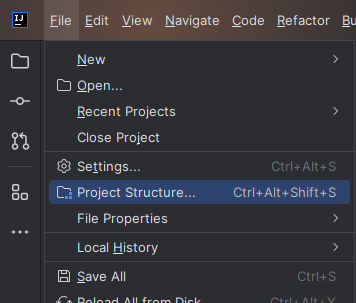
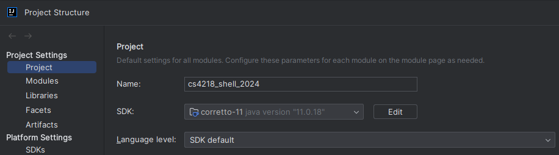
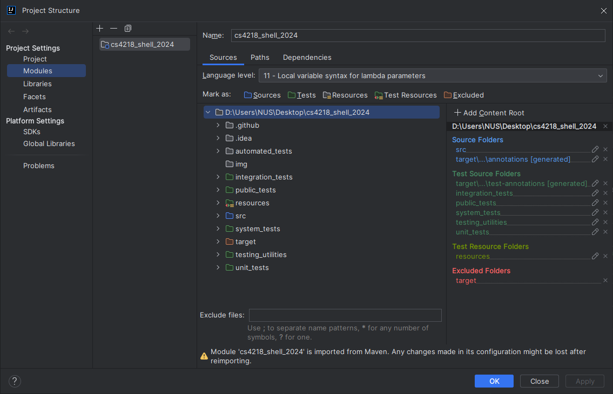

# Setup Project Structure
1. Go to [File] > [Project Structure]... (or press _Ctrl+Alt+Shift+S_)\
   
2. On the side, under Project Settings, select [Project]
3. For _SDK_, select one that is **Java 11**
4. Leave _Language Level_ as "SDK Default"
5. You should have something that looks like this:\
   
6. Click [Apply] to save changes
7. Next, on the side, under Project Settings, select [Modules]
8. You should have _cs4218_shell_2024_ as the only module
9. Under the _Sources_ tab, you should see a list of directories
10. Mark the following as :
    - integration_tests
    - public_tests
    - system_tests
    - testing_utilities
    - unit_tests
11. Mark the "resources" directory as 
12. You should have something that looks like this:\
    
13. Click [Apply] to save changes, and then [OK] to exit

# Automatic Testing Tools

In our project, we used 2 automatic testing tools. We explained in our report how we used these tools to improve the robustness
of our tests.
- [Pitest](automated_tests/pitest/README.md)
- [EvoSuite](automated_tests/evosuite-tests/README.md)

> [!TIP]
> Click on the hyperlink to see the README of the respective tools

Additionally, we included CI/CD workflow to automatically run our tests for PRs and the `main` branch.
This helps to ensure the integrity of the code and tests. The workflow runs and generate separate reports for
unit, integration and system tests. This allows us to quickly determine which type of test was failing, hence 
efficiently pinpointing the possible source of bug.
