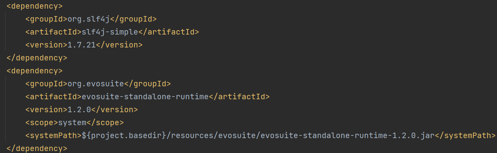

## Automatic Generation of Test Cases with EvoSuite

1. Install and set environment Path to jdk-11

2. Add Maven Dependencies to pom.xml:
   

3. Download evosuite-1.2.0.jar and evosuite-standalone-runtime-1.2.0.jar
   from https://github.com/EvoSuite/evosuite/releases/tag/v1.2.0 to resources/evosuite

4. In terminal, navigate to automated_tests and execute:
   java -jar ../resources/evosuite/evosuite-1.2.0.jar -class <fully qualified class name to test> -projectCP ../target/classes

   Optional coverage flags may be provided.

   For example, to generate tests for TeeApplication.java specifically for branch coverage:
   java -jar ../resources/evosuite/evosuite-1.2.0.jar -class sg.edu.nus.comp.cs4218.impl.app.TeeApplication -criterion branch -projectCP
   ../target/classes

5. Review the test cases before including into test suite. If including in test suite, rename/refactor the generated
   tests with meaningful names. 

   Note: To run evosuite generated tests alone, try: https://github.com/EvoSuite/evosuite/wiki/Tutorial%3A-Part-1--Evosuite-on-the-Command-Line#running-evosuite-tests.
   
   However, running an evosuite test depends on its corresponding scaffolding file that contains a setSystemProperties method with machine-specific properties.
   The same tests on a machine may not run on scaffolding files generated by another machine. If you face problems, an alternative is to copy the generated tests into your own file to run, as suggested by https://github.com/zhiyufan/EvoSuite-IDEA. Have fun :)