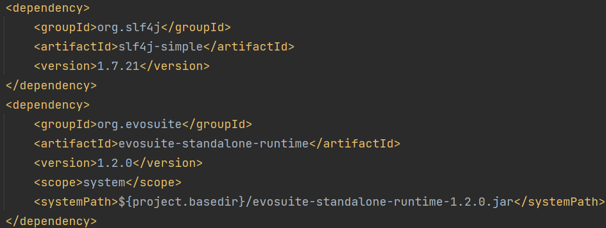

## Automatic Generation of Test Cases with EvoSuite

1. Install and set environment Path to jdk-11

2. Add Maven Dependencies to pom.xml:

3. Download evosuite-1.2.0.jar and evosuite-standalone-runtime-1.2.0.jar from https://github.com/EvoSuite/evosuite/releases/tag/v1.2.0 to project root

4. In terminal, navigate to project directory and execute:
java -jar evosuite-1.2.0.jar -class <fully qualified class name to test> -projectCP target/classes

Optional coverage flags may be provided.

For example, to generate tests for TeeApplication.java specifically for branch coverage:
java -jar evosuite-1.2.0.jar -class sg.edu.nus.comp.cs4218.impl.app.TeeApplication -criterion branch -projectCP target/classes

Alternatively, edit evosuite.bat as necessary and run it from project root.

5. Review the test cases before including into test suite. If including in test suite, rename/refactor the generated tests with meaningful names.